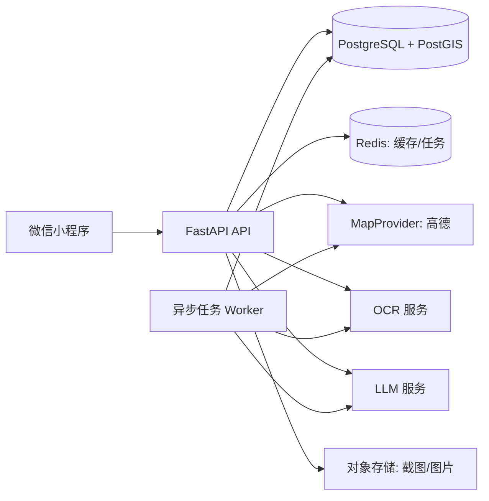
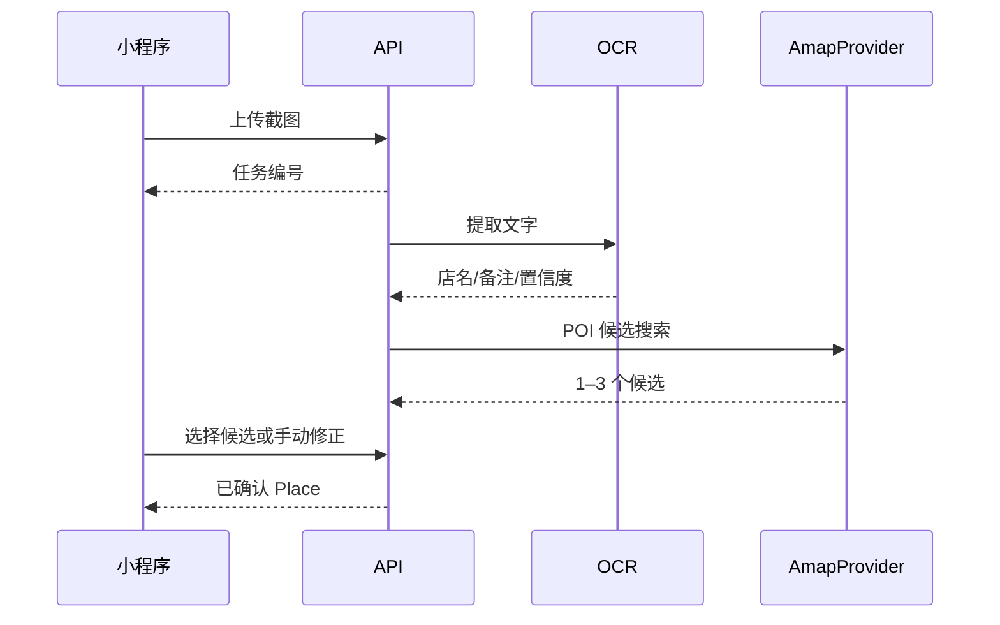

# 《馋猫局儿》技术设计方案（共享）

**版本：** v0.1
**读者：** 前端、后端共同维护
**产品定位：** 4–10 位朋友的周末美食短途组局工具；完成“收藏地点 → 共同决策 → AI 排行程 → 现场记账 → AA 结算 → 私密攻略/复刻”的闭环。

## 1. 决策摘要

| 决策 | v0.1 选择 | 原因 |
|---|---|---|
| 工程组织 | Monorepo | 前后端独立运行与部署，同时共享接口、文档和规范。 |
| 客户端 | Taro + React + TypeScript | 一套业务代码优先发布微信小程序，保留 Web 复用空间。 |
| 后端 | Python + FastAPI | 适合数据处理、OCR、LLM 工具调用和 OpenAPI 契约。 |
| 数据库 | PostgreSQL + PostGIS | 业务关系数据与地理距离查询使用同一套事务数据源。 |
| 地图能力 | 高德开放平台，封装为 `MapProvider` | 个人学习版本的公开配额、价格和小程序能力更适合 MVP；未来可替换。 |
| AI 方式 | 确定性约束 + LLM 编排 | 路线和账本不能由模型“猜”；LLM 只做理解、解释和受控工具调用。 |
| 异步任务 | FastAPI 任务模块 + Redis 队列 | 先满足截图 OCR、AI 生成等慢任务，避免过早拆微服务。 |

## 2. 仓库与边界

```text
chanchat-crew/
├─ apps/
│  ├─ miniapp/                 # Taro 小程序
│  └─ api/                     # FastAPI 单体后端
├─ packages/
│  └─ api-types/               # 从 OpenAPI 生成的 TypeScript 类型
├─ docs/
│  ├─ TECHNICAL-DESIGN.md
│  ├─ FRONTEND-IMPLEMENTATION.md
│  └─ BACKEND-IMPLEMENTATION.md
├─ infra/                       # 本地容器、环境样例、部署配置
└─ README.md
```

Monorepo 不等于同一进程：小程序与 API 各自构建、测试、部署。共享内容只包括 API 契约、类型、环境变量样例、质量规则和文档。

## 3. 系统架构



### 3.1 核心原则

1. **客户端不保存服务端密钥。** 高德 Web 服务、LLM、OCR Key 只放在 API 环境变量；小程序只调用自己的 API。
2. **确认后才入正式数据。** OCR/POI 只产生候选，用户确认后才创建可排入行程的地点。
3. **账本确定性计算。** 金额以“分”存储；分摊和债务化简为可测试的纯函数，LLM 不参与计算。
4. **AI 结构化输出。** LLM 返回必须通过 Pydantic/JSON Schema 校验，不合格结果不写入正式行程。
5. **提供商可替换。** 业务层只认识 `MapProvider`，不直接依赖高德请求格式。

## 4. 地图与成本策略

### 4.1 v0.1 接入边界

`MapProvider` 至少提供：

```text
searchPoi(query, city?, location?)
getPoiDetail(providerPoiId)
geocode(address)
reverseGeocode(location)
calculateRoute(stops, mode)
calculateDistance(origins, destinations)
```

实现 `AmapProvider` 作为默认适配器。前端地图页显示已确认地点、路线折线和状态标记；芝士是“推荐下一站/路线起点”标记，奶糖出现在账本与攻略成功状态。地点类别仍使用清晰、独立的图钉，避免吉祥物遮挡地图。

### 4.2 不混用数据源的规则

- 业务 POI、距离、路线来源于当前 `MapProvider`，不得把一个提供商的 POI/路线数据伪装为另一提供商数据。
- 小程序基础地图组件、地图标注素材及路线展示须在开发前复核微信与高德的当期条款。
- 记录 `provider`、`provider_poi_id`、请求时间和原始响应摘要，便于重新检索与调试。

### 4.3 成本护栏

- 对相同地点检索、相同行程输入计算缓存；缓存 Key 包含组局数据版本与指令摘要。
- POI 输入提示在前端做 300–500ms 防抖；后端每用户和每组局限流。
- 首版限制每局每日 AI 行程生成 3 次、截图识别 10 张；超限提示次日再试，不做充值。
- 每次第三方调用记录：能力、供应商、耗时、成功、估算费用、缓存命中。

官方价格/条款的核对链接：

- [高德基础服务计费与配额](https://lbs.amap.com/pages/base_service_price)
- [高德个人与商业使用说明](https://lbs.amap.com/faq/advisory/authorization/43168)
- [腾讯位置服务商业授权 FAQ](https://lbs.qq.com/faq/authorizationFaq)

## 5. 领域模型

| 实体 | 关键字段 | 说明 |
|---|---|---|
| `User` | `id, wechat_openid, nickname` | 身份与展示资料。 |
| `Crew` | `id, owner_id, title, start_at, return_at, start_point, budget_range, status` | 一次“局”。 |
| `CrewMember` | `crew_id, user_id, role, joined_at` | 成员与局主权限。 |
| `Place` | `crew_id, name, category, lng, lat, provider, provider_poi_id, status` | 已确认或待确认地点。 |
| `PlaceSource` | `place_id, type, url, image_id, ocr_text, confidence` | 手输、链接或截图来源；不抓取第三方正文。 |
| `PlaceVote` | `place_id, user_id, choice, note` | 想去/不想去与备注。 |
| `Itinerary` | `crew_id, version, state, constraints_json, selected_plan_id` | 可追溯行程版本。 |
| `ItineraryStop` | `plan_id, place_id, order, eta_start, eta_end, decision_reason` | 行程站点。 |
| `Expense` | `crew_id, paid_by, amount_cents, split_method, place_id` | 一笔消费。 |
| `ExpenseShare` | `expense_id, user_id, amount_cents` | 消费分摊结果。 |
| `GuideSnapshot` | `crew_id, token_hash, public_fields_json, version, published_at` | 脱敏的私密分享攻略快照。 |

所有可编辑实体均有 `created_at`、`updated_at`；账单、地点状态、已选行程保留审计事件。

## 6. 关键数据流

### 6.1 截图到地点



低置信度时只显示候选与原始 OCR 文字，不自动入库。视觉模型只能作为 OCR 的低置信度回退。

### 6.2 AI 行程

1. API 汇总已确认地点、开放时间、投票、日期、出发/返程点、预算和用户指令。
2. 约束引擎先过滤不可用地点并给出 2–3 条距离/时段合理的候选顺序。
3. LLM 仅能调用受控工具读取候选并生成结构化解释、取舍和可编辑计划。
4. API 校验地点 ID、时间顺序、JSON Schema；失败则返回“未生成可用方案”。
5. 用户选择方案或拖拽后创建新版本；不能静默覆盖旧版本。

## 7. API 契约与安全

- API 前缀：`/api/v1`；JSON；统一错误结构为 `code / message / request_id / details?`。
- FastAPI 自动生成 OpenAPI；CI 导出 OpenAPI 后生成 `packages/api-types`。
- 写接口携带访问令牌；服务端依据 `CrewMember` 判定权限，不信任客户端的 `owner` 字段。
- 图片上传使用短时签名 URL 或受控上传接口；服务端校验 MIME、尺寸、文件大小并删除 EXIF 地理信息。
- 攻略使用不可猜测 token；默认不包含成员、头像、单笔账目、转账关系、原截图和来源链接。
- 日志中不得记录访问令牌、完整地址、图片内容或模型原始提示词中的敏感资料。

## 8. 非功能要求与验收

| 维度 | v0.1 标准 |
|---|---|
| 正确性 | 任意账本下净额和为 0；债务化简与金额计算有单测。 |
| 可用性 | AI/OCR/地图失败时，手动地点、手动排序和账本仍可使用。 |
| 性能 | 常规 API 目标 P95 < 2 秒；AI 任务有进度、取消与重试状态。 |
| 观测 | 记录 API 错误率、第三方调用失败率、缓存命中、OCR→确认率和单局 AI 成本。 |
| 隐私 | 分享仅导出明确勾选的字段；攻略保存为独立版本快照。 |

## 9. 开工顺序

1. 建立 Monorepo、前后端骨架、OpenAPI 类型生成和本地数据库。
2. 完成登录模拟、组局/成员、手动地点和地图列表联动。
3. 完成账本、分摊与结算算法，先用单元测试锁定正确性。
4. 接入高德 POI 与路线，增加缓存、限流和调用日志。
5. 接入截图 OCR 的候选确认流程。
6. 接入受控 AI 行程和私密攻略/复刻。

## 10. 当前未决项

- 微信登录的 AppID、正式发布主体和隐私政策在提交审核前确定；本地开发先使用模拟身份。
- OCR/LLM 厂商在实现时根据可用预算确定，但必须满足结构化输出和调用日志要求。
- 正式商业运营前重新核对地图、LLM、对象存储与用户数据处理条款。
