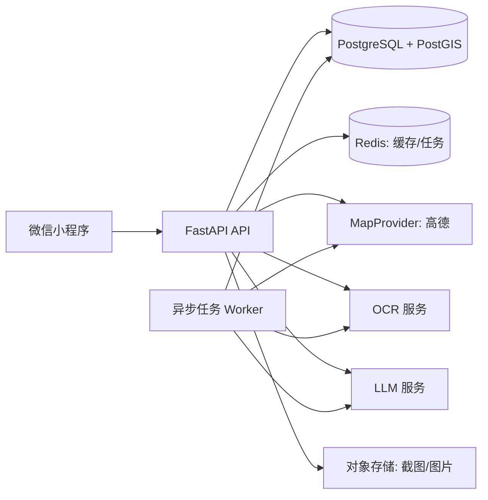
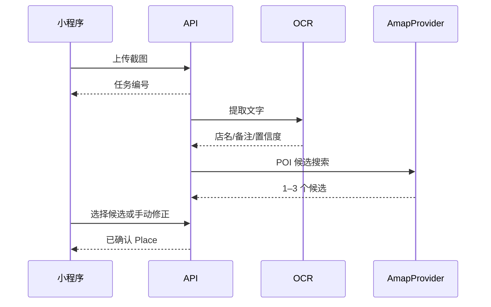

# 《馋猫局儿》技术设计方案（共享）

**版本：** v0.3
**读者：** 前端、后端共同维护
**产品定位：** 4–10 位朋友的周末美食短途组局工具；完成“收藏地点 → 共同决策 → AI 排行程 → 现场记账 → AA 结算 → 私密攻略/复刻”的闭环。

## 1. 决策摘要

| 决策 | v0.3 选择 | 原因 |
|---|---|---|
| 工程组织 | Monorepo | 前后端独立运行与部署，同时共享接口、文档和规范。 |
| 客户端 | Taro + React + TypeScript | 一套业务代码优先发布微信小程序，保留 Web 复用空间。 |
| 后端 | Python + FastAPI | 适合数据处理、OCR、LLM 工具调用和 OpenAPI 契约。 |
| 数据库 | PostgreSQL + PostGIS | 业务关系数据与地理距离查询使用同一套事务数据源。 |
| 地图能力 | 高德开放平台，封装为 `MapProvider` | 个人学习版本的公开配额、价格和小程序能力更适合 MVP；未来可替换。 |
| AI 方式 | 确定性约束 + LLM 编排 | 路线和账本不能由模型“猜”；LLM 只做理解、解释和受控工具调用。 |
| 异步任务 | FastAPI 任务模块 + Redis 队列 | 先满足截图 OCR、AI 生成等慢任务，避免过早拆微服务。 |

## 2. 仓库与边界

```text
chanchat-crew/
├─ apps/
│  ├─ miniapp/                 # Taro 小程序
│  └─ api/                     # FastAPI 单体后端
├─ packages/
│  └─ api-types/               # 从 OpenAPI 生成的 TypeScript 类型
├─ docs/
│  ├─ TECHNICAL-DESIGN.md
│  ├─ FRONTEND-IMPLEMENTATION.md
│  └─ BACKEND-IMPLEMENTATION.md
├─ infra/                       # 本地容器、环境样例、部署配置
└─ README.md
```

Monorepo 不等于同一进程：小程序与 API 各自构建、测试、部署。共享内容只包括 API 契约、类型、环境变量样例、质量规则和文档。

## 3. 系统架构


```mermaid
flowchart LR
  U[微信小程序] --> API[FastAPI API]
  API --> PG[(PostgreSQL + PostGIS)]
  API --> R[(Redis: 缓存/任务)]
  API --> MAP[MapProvider: 高德]
  API --> OCR[OCR 服务]
  API --> LLM[LLM 服务]
  API --> OBJ[对象存储: 截图/图片]
  W[异步任务 Worker] --> OCR
  W --> MAP
  W --> LLM
  W --> PG
```

### 3.1 核心原则

1. **客户端不保存服务端密钥。** 高德 Web 服务、LLM、OCR Key 只放在 API 环境变量；小程序只调用自己的 API。
2. **确认后才入正式数据。** OCR/POI 只产生候选，用户确认后才创建可排入行程的地点。
3. **账本确定性计算。** 金额以“分”存储；分摊和债务化简为可测试的纯函数，LLM 不参与计算。
4. **AI 结构化输出。** LLM 返回必须通过 Pydantic/JSON Schema 校验，不合格结果不写入正式行程。
5. **提供商可替换。** 业务层只认识 `MapProvider`，不直接依赖高德请求格式。

## 4. 地图与成本策略

### 4.1 v0.3 接入边界

`MapProvider` 至少提供：

```text
searchPoi(query, city?, location?)
getPoiDetail(providerPoiId)
geocode(address)
reverseGeocode(location)
calculateRoute(stops, mode)
calculateDistance(origins, destinations)
```

实现 `AmapProvider` 作为默认适配器。前端地图页显示已确认地点、路线折线和状态标记；芝士是“推荐下一站/路线起点”标记，奶糖出现在账本与攻略成功状态。地点类别仍使用清晰、独立的图钉，避免吉祥物遮挡地图。

### 4.2 不混用数据源的规则

- 业务 POI、距离、路线来源于当前 `MapProvider`，不得把一个提供商的 POI/路线数据伪装为另一提供商数据。
- 小程序基础地图组件、地图标注素材及路线展示须在开发前复核微信与高德的当期条款。
- 记录 `provider`、`provider_poi_id`、请求时间和原始响应摘要，便于重新检索与调试。

### 4.3 成本护栏

- 对相同地点检索、相同行程输入计算缓存；缓存 Key 包含组局数据版本与指令摘要。
- POI 输入提示在前端做 300–500ms 防抖；后端每用户和每组局限流。
- 首版使用积分与次数双门槛：新用户 100 分，AI 行程 20 分/次，链接解析 5 分/次；同时限制每用户每日 3 次、本月 5 次 AI 行程，不开放充值。
- 每次第三方调用记录：能力、供应商、耗时、成功、估算费用、缓存命中。

官方价格/条款的核对链接：

- [高德基础服务计费与配额](https://lbs.amap.com/pages/base_service_price)
- [高德个人与商业使用说明](https://lbs.amap.com/faq/advisory/authorization/43168)
- [腾讯位置服务商业授权 FAQ](https://lbs.qq.com/faq/authorizationFaq)

## 5. 领域模型

| 实体 | 关键字段 | 说明 |
|---|---|---|
| `User` | `id, wechat_openid, nickname, avatar_url, profile_completed_at` | 平台身份与用户明确确认后的展示资料。 |
| `Crew` | `id, owner_id, title, start_at, return_at, region_code, status, visibility` | 一次攻略；创建时 visibility=private。 |
| `CrewMember` | `crew_id, user_id, role, joined_at` | 成员与局主权限。 |
| `Place` | `crew_id, name, category, lng, lat, provider, provider_poi_id, status` | 已确认或待确认地点。 |
| `PlaceSource` | `place_id, type, url, image_id, ocr_text, confidence` | 手输、链接或截图来源；不抓取第三方正文。 |
| `PlaceVote` | `place_id, user_id, choice, note` | 想去/不想去与备注。 |
| `Itinerary` | `crew_id, version, state, constraints_json, selected_plan_id` | 可追溯行程版本。 |
| `ItineraryStop` | `plan_id, place_id, day_index, local_date, local_start_time, order_in_day, duration_minutes, decision_reason` | 归属于攻略日期区间内某一天的行程站点。 |
| `Expense` | `crew_id, paid_by, amount_cents, split_method, place_id` | 一笔消费。 |
| `ExpenseShare` | `expense_id, user_id, amount_cents` | 消费分摊结果。 |
| `GuideSnapshot` | `crew_id, public_fields_json, version, review_state, published_at` | 审核通过后供公开广场使用的脱敏快照。 |

所有可编辑实体均有 `created_at`、`updated_at`；账单、地点状态、已选行程保留审计事件。

## 6. 关键数据流

### 6.1 截图到地点


```mermaid
sequenceDiagram
  participant C as 小程序
  participant A as API
  participant O as OCR
  participant M as AmapProvider
  C->>A: 上传截图
  A-->>C: 任务编号
  A->>O: 提取文字
  O-->>A: 店名/备注/置信度
  A->>M: POI 候选搜索
  M-->>A: 1–3 个候选
  C->>A: 选择候选或手动修正
  A-->>C: 已确认 Place
```

低置信度时只显示候选与原始 OCR 文字，不自动入库。视觉模型只能作为 OCR 的低置信度回退。

### 6.2 AI 行程

1. API 汇总已确认地点、开放时间、投票、攻略起止日期、出发/返程点和用户指令，并计算首尾包含的 day_count。
2. 约束引擎先过滤不可用地点并给出 2–3 条距离/时段合理的候选顺序。
3. LLM 仅能调用受控工具读取候选并生成结构化解释、取舍和可编辑计划。
4. API 校验地点 ID、时间顺序、JSON Schema；失败则返回“未生成可用方案”。
5. 用户选择方案或拖拽后创建新版本；不能静默覆盖旧版本。

## 7. API 契约与安全

- API 前缀：`/api/v1`；JSON；统一错误结构为 `code / message / request_id / details?`。
- FastAPI 自动生成 OpenAPI；CI 导出 OpenAPI 后生成 `packages/api-types`。
- 首版所有小程序业务接口（包括公开广场与公开详情）均携带访问令牌；服务端依据 `CrewMember` 判定私密资源权限，不信任客户端的 `owner` 字段。
- 图片上传使用短时签名 URL 或受控上传接口；服务端校验 MIME、尺寸、文件大小并删除 EXIF 地理信息。
- 攻略使用不可猜测 token；默认不包含成员、头像、单笔账目、转账关系、原截图和来源链接。
- 日志中不得记录访问令牌、完整地址、图片内容或模型原始提示词中的敏感资料。

## 8. 非功能要求与验收

| 维度 | v0.4 标准 |
|---|---|
| 正确性 | 任意账本下净额和为 0；债务化简与金额计算有单测。 |
| 可用性 | AI/OCR/地图失败时，手动地点、手动排序和账本仍可使用。 |
| 性能 | 常规 API 目标 P95 < 2 秒；AI 任务有进度、取消与重试状态。 |
| 观测 | 记录 API 错误率、第三方调用失败率、缓存命中、OCR→确认率和单局 AI 成本。 |
| 隐私 | 分享仅导出明确勾选的字段；攻略保存为独立版本快照。 |

## 9. 开工顺序

1. 建立 Monorepo、前后端骨架、OpenAPI 类型生成和本地数据库。
2. 完成微信 code 会话交换、头像/昵称确认、私密攻略与成员权限。
3. 完成账本、分摊与结算算法，先用单元测试锁定正确性。
4. 接入高德 POI 与路线，增加缓存、限流和调用日志。
5. 接入截图 OCR 的候选确认流程。
6. 接入受控 AI 行程、发布审核、公开快照与复刻。

## 10. 当前未决项

- 微信登录的 AppID、正式发布主体和隐私政策在提交审核前确定；HTML 原型只模拟 code 换取会话及头像/昵称确认，不代表真实接口已接入。
- OCR/LLM 厂商在实现时根据可用预算确定，但必须满足结构化输出和调用日志要求。
- 正式商业运营前重新核对地图、LLM、对象存储与用户数据处理条款。

## 11. v0.2 架构增补

### 新增服务边界

~~~text
小程序 → Link Parse API → URL 白名单/缓存 → 公开元信息或用户文本/截图
                                      → OCR/实体提取 → MapProvider POI 候选 → 用户确认
小程序 → AI Task API → Credit Reservation → 约束引擎/LLM → Confirm 或 Release
发布审核事件 → Public Guide Index + Credit Reward
~~~

新增领域实体：

| 实体 | 关键字段 | 说明 |
|---|---|---|
| LinkParseJob | user_id, crew_id, normalized_url_hash, state, cost_snapshot | 分享链接异步解析任务。 |
| LinkPlaceCandidate | job_id, name, confidence, poi_candidates_json, selected_poi_id | 未经用户确认不得成为正式地点。 |
| CreditAccount | user_id, balance, version | 通过行锁或乐观锁防止并发透支。 |
| CreditLedgerEntry | user_id, delta, reason, rule_version, idempotency_key | 不可变积分流水。 |
| CreditReservation | task_id, amount, state, expires_at | AI 任务预占、确认或释放。 |
| AiUsageCounter | user_id, period, used | 每日与每月限频。 |
| UserSetting | user_id, notifications_json, privacy_json | 设置页偏好。 |

### 统一门槛

AI 行程任务必须同时满足：

- 已确认地点数不少于 3。
- 积分余额不少于 20。
- 本月 AI 行程少于 5 次。
- 今日 AI 行程少于 3 次。

链接解析成功确认时扣 5 分；任务失败或进入 fallback 不扣。公开攻略审核通过奖励 30 分，每月最多 3 次。所有数值由带版本的规则配置提供，客户端展示服务端返回的规则快照。

### 文档一致性

需求变化后按以下优先级更新：PRD → TECHNICAL-DESIGN → FRONTEND/BACKEND-IMPLEMENTATION → README → 历史决策增补。API、状态机、费用、权限、验收标准必须跨文档一致。

## 12. v0.3 身份、可见性与视觉增补

### 微信身份与展示资料

~~~text
小程序 wx.login → 一次性 code → POST /auth/wechat/session
                                  → 服务端 code2Session → User/OpenID → 业务 access token

用户选择头像 + 输入昵称 → PATCH /me/profile → 已确认的展示资料
~~~

身份建立与资料确认是两个状态。首次用户完成头像昵称确认后才通过产品 AuthGate；后续资料修改失败不撤销已建立会话。一次性 code、session_key 和 OpenID 不写客户端持久化或业务日志；会话令牌使用短期访问令牌与可撤销刷新机制。

### 攻略可见性状态

~~~text
private → reviewing → published
    ↑          |
    └──────────┘ 审核拒绝或创建者撤回
~~~

- `private`：仅创建者与 CrewMember 可读写。
- `reviewing`：私密协同继续可用，但公开快照尚不可搜索。
- `published`：生成独立 GuideSnapshot 并写入公开索引；私密实体继续受成员权限保护。
- 任何公开查询只读取 GuideSnapshot，不得回退读取 Crew、Expense、ExpenseSplit、Settlement、Transfer、PlaceSource 或成员资料；AA 字段禁止进入公开 DTO。
- “我创建的”按 owner_id 查询；“我加入的”按 CrewMember 查询并排除 owner；“收藏”只引用可见的公开快照。

新增实体：

| 实体 | 关键字段 | 说明 |
|---|---|---|
| PublicationSubmission | crew_id, snapshot_version, state, submitted_by, reviewed_at | 发布审核状态和审计。 |
| SavedGuide | user_id, guide_snapshot_id, created_at | 用户收藏；快照下架后不可继续公开访问。 |
| UserSession | user_id, refresh_token_hash, expires_at, revoked_at | 可撤销业务会话。 |

### 原型视觉令牌

原型提供四套候选主题：日光橘、珊瑚汽水、青柚森林、莓果晴空。主题只改变品牌主色、辅色、状态色和有限渐变；布局合同固定为 18px 内容卡圆角、12–16px 内边距、1px 浅边框和轻阴影。正式客户端只保留最终确认主题，其他主题不构成服务端用户偏好合同。

添加地点首版只保留 POI 搜索和公开分享链接识别。地图仍用于展示已确认地点和规划路线，但不提供地图中心点创建地点。

### v0.4 首次进入与公开详情数据流

~~~text
启动/分享深链 → AuthGate → wx.login code → 业务会话 → 头像昵称确认 → 首页/恢复目标页
公开卡片 → PublicGuideSnapshot 详情 → 收藏 或 复制公开路线 → 新建 private 攻略
~~~

- 身份会话与展示资料是两个步骤；首次产品门槛要求两步完成，后续资料更新不影响会话。
- intended_route 只保存页面标识和公开 snapshot_id，不保存一次性 code 或 session_key。
- PublicGuideSnapshot 使用显式 allow-list：标题、目的地、start_date、end_date、day_count、公开标签、公开媒体、带 day_index/local_date 的路线节点和统计信息。
- Expense、ExpenseSplit、Settlement、Transfer、CrewMember、PlaceSource 与内部评论只能存在私密域，发布管道和公开查询层都不能引用。

### 按天行程不变量

- `day_count = end_date - start_date + 1`，按目的地本地自然日计算，首尾日期均包含。
- 每个 ItineraryStop 必须满足 `1 <= day_index <= day_count`，且 `local_date = start_date + day_index - 1`；服务端不信任客户端传入的派生日期。
- 同一天使用 `order_in_day` 和 `local_start_time` 排序。跨天移动同时更新 day_index、local_date、order_in_day，并使受影响交通段进入待重算状态。
- AI 可在某些日期返回空数组，但不得生成日期区间外节点或为了填满天数虚构地点。
- 公开快照和私密套用保留日期区间与 day_index；账本和成员关系仍不复制。